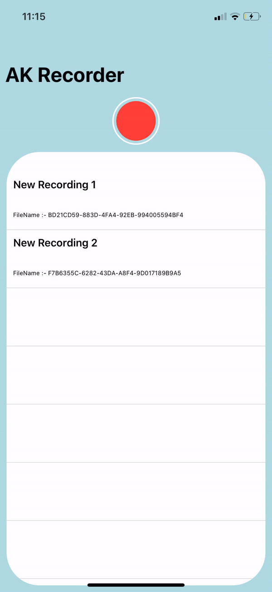

# Audio-Recorder
> Audio Recorder Helper Class in swift 🎙

> includes record, Play, stop, delete etc 🎙

> includes computed properties and completion handlers🎙

## Implementation

```Swift
var recorder = AKAudioRecorder.shared
```

 ## Screenshots
 > "of Example Project"
 <p float="left">
 
  
       
 
 </p>
 
 ### Before You Use ⚠️

```Swift
      Upadte your info.plist to access microphone
```

###### Recorder Functions

```Swift
      recorder.record()
```
```Swift
      recorder.stopRecording()
```
```Swift
      recorder.isRecording // True | False 
```

###### Player Functions

```Swift
      recorder.play()
      recorder.play(name:"mySong")
```
```Swift
      recorder.stopPlaying()
```
```Swift
      recorder.isPlaying // True | False 
```

###### Delete

```Swift
      recorder.deleteRecording(name: "mySong")
```

## Miscellaneous 🤷🏻‍♂️

 ###### Set recording Name ( Set Property )
 ```Swift
     recorder.recordingName // set String for recording Name
     Default value = NSUUID().uuidString // Thats a random unique string 
     eg: // Recording name will be saved in path of your name choice.
     recorder.recordingName = "myRecording123"   
     recorder.play(name: "myRecording123")
```

###### Time ( Get Property ) ⏱
```Swift
     recorder.getCurrentTime() // Time Played of recording
     recorder.getDuration() // Duration of recordng
```
  
 ###### Number Of Loops ( Set Property ) ♾
 ```Swift
     recorder.numberOfLoops // set Interger to repeat recording. 
     Default value = 0
     eg: // Recording will play 5 times
     recorder.numberOfLoops = 4   
     recorder.play()
```

 ###### Rate of Playback ( Set Property ) ⏭
 ```Swift
     recorder.rate // set Float to change rate of recording.
     Default value = 1
     0.5 ≤ rate ≤ 2
     eg: // Recording will play at 1.5x speed
     recorder.rate = 1.5
     recorder.play()
```

 ###### Your Saved Recordings ( Get Property ) 🔰
 ```Swift
     recorder.getRecordings // [String]
     will return an array of locations || name of recordings.
     //Can be used to display multiple recordings in tableView etc.
```     


